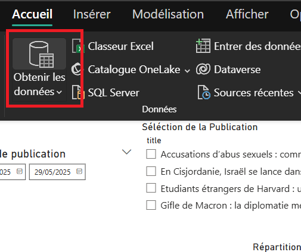
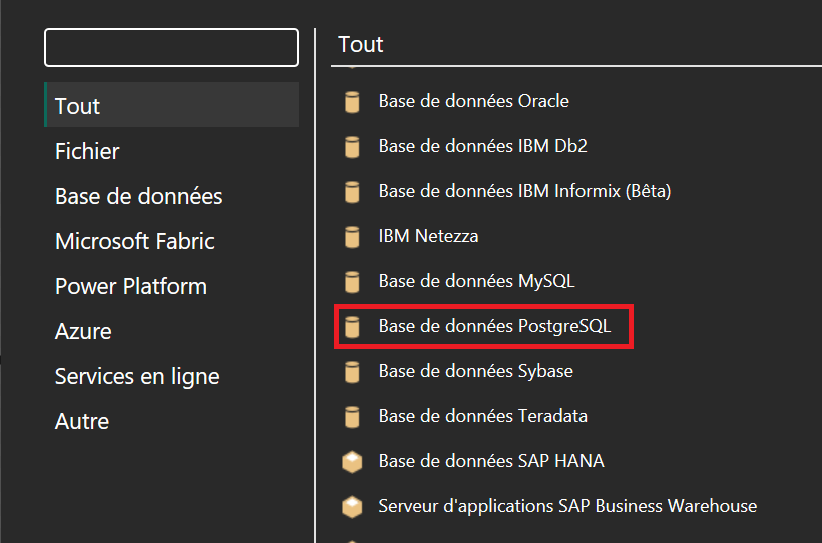
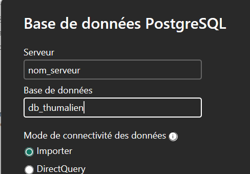
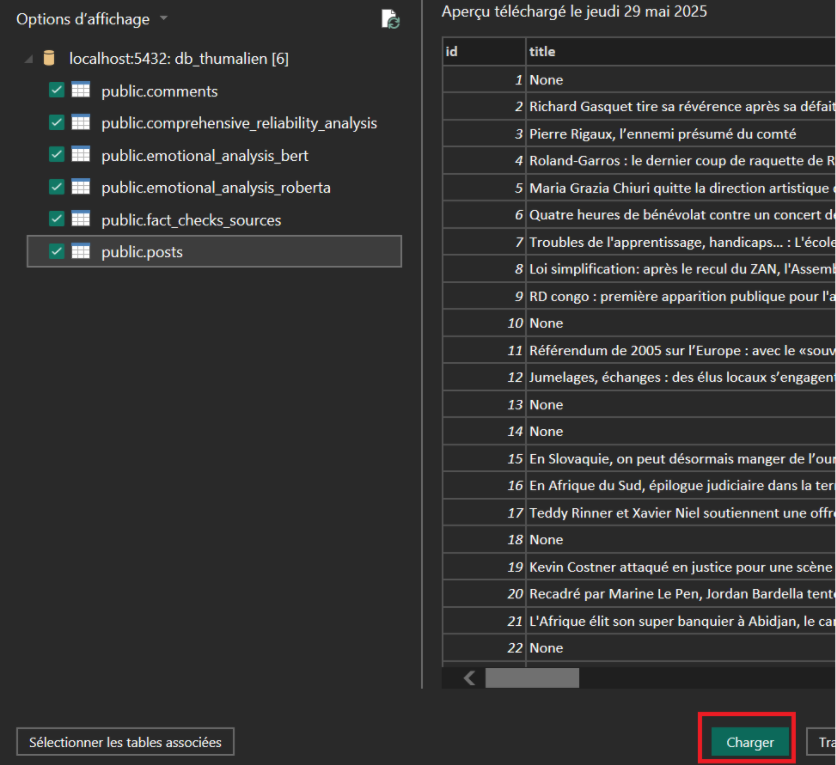
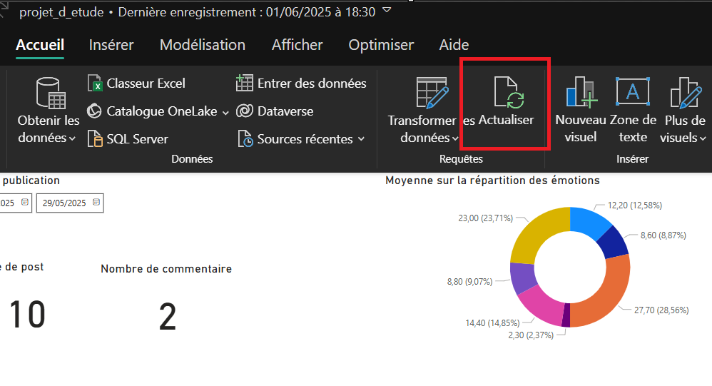

# **Détection des Fake News de Tweets: Lutte contre la désinformation**

## **Présentation de Thumalien et du projet**

Thumalien est un journal impliqué dans la lutte contre la désinformation, alliant une expertise journalistique dans la déconstruction des contenus numériques.

Dans le cadre de son engagement à atteindre cet objectif, Thumalien lance un projet innovant visant à renforcer ses capacités d'analyse d'informations. Le but de ce projet est de développer un outil d'analyse automatisé, capable d'identifier et de classer les tweets en provenance de Bluesky en fonction de leur probabilité d'être des fake-news. En s'appuyant sur des techniques de traitement du langage naturel (NLP) et d'algorithmes de machine learning, Thumalien aspire à améliorer la fiabilité, la rapidité et la précision des analyses tout en sensibilisant le public aux enjeux de la désinformation.

Ce guide utilisateur vous accompagnera tout au long du projet, en fournissant des instructions détaillées sur l'utilisation des outils développés.

## Guide d'utilisation de la solution technologique

### Installation

Pour récupérer le repository du projet, lancez cette commande dans votre terminal:

```
git clone https://github.com/atiti27/projet_etudes_thumalien_m1.git
```

Pour lancer le projet, assurer vous d'être à la racine du projet `projet_etudes_thumalien`. Il faut avant tout installer les packages correspondants. Nous avons déjà mis à disposition les librairies requises dans le fichier `requirements.txt`. Pour leurs installations, il suffit de lancer la commande suivante:

```
pip install -r requirements.txt
```

D'autres librairies sont dépendantes de celles listées dans le fichier `requirements.txt`. Si vous n'avez pas PyTorch, installez le avec la commande suivante (pour Windows)

```
pip3 install torch torchvision torchaudio --index-url https://download.pytorch.org/whl/cu118
python -m spacy download fr_core_news_sm
```

En amont, créer une base de données avec un nom, par exemple `db_thumalien`.

Enfin, vous pouvez lancer le script via la commande suivante:

```
python main.py
```

Ce script va automatiquement lancer:
- la création des tables
- l'extraction des tweets et des commentaires
- le prétraitement de ces données
- le stockage de ces données dans la base de données PostgreSQL
- l'analyse émotionnelle RoBERTa
- l'analyse de détection de fake news RoBERTa

Si vous souhaitez lancer à des étapes spécifiques du code indépendamment du script principal, vous pouvez toujours les exécuter à l'aide de la commande `python [nom_script]`.

Un fichier Power BI est disponible, vous pouvez y consulter les différentes visualisations suite aux analyses effectuées.

Avant cela, il faut configurer votre connexion à votre base de données.

- Dans l'accueil, cliquer sur l'icône **Obtenir les données**



- Un onglet s'affiche, sélectionner la source de données **Base de données PostgreSQL**



- Un nouvel onglet s'affiche demandant les informations de connexion à la base de données. Saisissez le nom/adresse du serveur et le nom de la base de données.



- Un affichage avec l'ensemble des tables est montré, sélectionner l'ensemble des tables et cliquer sur le bouton **Charger**.



